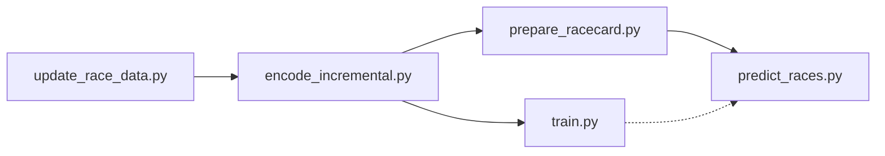

# UK Race Predictor

A machine learning system for predicting UK horse race outcomes using LightGBM. The system processes historical race data, engineers features, trains models, and generates predictions for upcoming races.

## 🐎 What This Project Does

The UK Race Predictor is a complete end-to-end machine learning pipeline that:

- **Collects** historical UK horse racing data using [rpscrape](https://github.com/4A47/rpscrape)
- **Processes** and encodes race data into features for machine learning
- **Engineers** sophisticated features including:
  - Horse historical performance (win rates, course/distance/going preferences)
  - Jockey and trainer statistics (recent form, course specialties)
  - 14-day recent form indicators
  - Time-based features (seasonal patterns)
- **Trains** LightGBM models with probability calibration
- **Predicts** race outcomes with calibrated win probabilities
- **Supports** multiple model versions and betting strategies

## 🚀 Quick Start

### Prerequisites

1. **Python 3.8+** with pip
2. **rpscrape** - Clone and set up [rpscrape](https://github.com/4A47/rpscrape) for data collection

### Installation

1. Clone this repository:
```bash
git clone https://github.com/rickhcchan/UKRacePredictor.git
cd UKRacePredictor
```

2. Install dependencies:
```bash
pip install -r requirements.txt
```

3. Set up configuration (see Configuration section below)

## ⚙️ Configuration

### Setting Up Custom Configuration

1. **Copy the template:**
```bash
cp config/user_settings.conf.template config/user_settings.conf
```

2. **Edit your personal settings:**
```ini
# config/user_settings.conf
[common]
# Path to your rpscrape installation
rpscrape_dir = /path/to/your/rpscrape

# Adjust timeout if needed (seconds)
timeout = 60

# Optional: Change data locations
db_path = data/race_data.db
data_dir = data
models_dir = models
```

### Configuration Files

- **`config/default_settings.conf`** - Default settings (version controlled)
- **`config/user_settings.conf`** - Your personal settings (not in git)
- **`config/user_settings.conf.template`** - Template for personal settings

The system loads `user_settings.conf` first, falling back to `default_settings.conf` for missing values.

## 📊 Pipeline Overview

The system consists of 5 main scripts that form a complete ML pipeline:



**Pipeline Flow:**
- `update_race_data.py` → `encode_incremental.py` → Data preparation
- `encode_incremental.py` → `train.py` → Model training (optional, when retraining)
- `encode_incremental.py` → `prepare_racecard.py` → `predict_races.py` → Daily predictions

All scripts support `--dry-run` for testing and use minimal, essential parameters for clean operation.

## 🔄 Usage Guide

### 1. Initial Setup (First Time Only)

```bash
# Update historical data (may take time for initial download)
python scripts/update_race_data.py

# Encode all historical data into features
python scripts/encode_incremental.py --force-rebuild

# Train the default model
python scripts/train.py
```

### 2. Daily Prediction Workflow

```bash
# Step 1: Update historical data (adds yesterday's results)
python scripts/update_race_data.py

# Step 2: Encode new data into features  
python scripts/encode_incremental.py

# Step 3: Prepare today's racecard (or tomorrow's)
python scripts/prepare_racecard.py                    # Today
python scripts/prepare_racecard.py --date 2025-07-12  # Tomorrow

# Step 4: Generate predictions (uses default model and strategy)
python scripts/predict_races.py                       # Today
python scripts/predict_races.py --date 2025-07-12     # Tomorrow
```

### 3. Use Custom Models

```bash
# Retrain default model with new data
python scripts/train.py

# Train custom model versions
python scripts/train.py --model v1
python scripts/train.py --model experimental

# Use custom models
python scripts/train.py --model my_model
python scripts/predict_races.py --model my_model
```

## 📋 Script Reference

### `update_race_data.py`
Downloads and stores historical race results using rpscrape.

```bash
# Update to current date (default behavior)
python scripts/update_race_data.py

# Test run without changes
python scripts/update_race_data.py --dry-run
```

### `encode_incremental.py`
Processes raw race data into machine learning features.

```bash
# Encode new data since last run
python scripts/encode_incremental.py

# Force complete rebuild (after schema changes)
python scripts/encode_incremental.py --force-rebuild

# Test run without changes
python scripts/encode_incremental.py --dry-run
```

### `train.py`
Trains LightGBM models with probability calibration using JSON configurations.

```bash
# Train default model
python scripts/train.py

# Train specific model configuration
python scripts/train.py --model v2

# Test run without training
python scripts/train.py --dry-run
```

### `prepare_racecard.py`
Downloads and prepares racecard for prediction with feature engineering.

**Note:** Can only download racecards for today or tomorrow (rpscrape limitation).

```bash
# Prepare today's racecard (default)
python scripts/prepare_racecard.py

# Prepare tomorrow's racecard
python scripts/prepare_racecard.py --date 2025-07-12

# Test run without changes
python scripts/prepare_racecard.py --dry-run

# Dry run for specific date
python scripts/prepare_racecard.py --date 2025-07-12 --dry-run
```

### `predict_races.py`
Generates win probability predictions for prepared racecards using JSON model configurations.

```bash
# Predict with default model and default strategy
python scripts/predict_races.py

# Predict with specific model
python scripts/predict_races.py --model v2

# Console output only (no CSV file)
python scripts/predict_races.py --no-save

# Predict with specific strategy
python scripts/predict_races.py --strategy default

# Predict with both custom model and strategy
python scripts/predict_races.py --model v2 --strategy default

# Predict specific date
python scripts/predict_races.py --date 2025-07-08

# Combined options
python scripts/predict_races.py --date 2025-07-08 --model v2 --strategy default --no-save
```

## 📁 Project Structure

```
UKRacePredictor/
├── README.md
├── requirements.txt
├── config/
│   ├── default_settings.conf     # Default system settings
│   ├── user_settings.conf.template
│   └── models/
│       └── default.json          # Default model configuration
├── scripts/
│   ├── update_race_data.py       # Data collection
│   ├── encode_incremental.py     # Feature engineering
│   ├── train.py                  # Model training
│   ├── prepare_racecard.py       # Racecard preparation
│   ├── predict_races.py          # Prediction generation
│   ├── betting_strategy.py       # Strategy base class
│   ├── strategy_factory.py       # Strategy factory
│   └── strategies/
│       └── default.py            # Default betting strategy
├── data/                         # Data files (not in git)
├── models/                       # Trained models (not in git)
└── docs/
```

## 🎯 Model Configuration

### Using Different Model Configurations

```bash
# Train different models
python scripts/train.py                           # Uses default.json
python scripts/train.py --model v1                # Uses v1.json  
python scripts/train.py --model v2                # Uses v2.json
python scripts/train.py --model no_ratings        # Uses custom model

# Predict with specific models
python scripts/predict_races.py                   # Uses default model
python scripts/predict_races.py --model v1        # Uses v1 model
python scripts/predict_races.py --model experimental # Uses custom model

# Quick start for simple workflow - just edit default.json
python scripts/train.py      # Train with your custom default.json
python scripts/predict_races.py  # Predict with your custom default.json
```

### JSON Configuration Format

Model configurations are stored in `config/models/*.json`:

```json
{
  "model_name": "default",
  "description": "Default model configuration",
  "features": {
    "categorical": ["course_id", "type_id", "sex_id"],
    "ordinal": ["age", "lbs", "dist_f", "ran", "draw"]
  },
  "training_params": {
    "objective": "binary",
    "metric": "binary_logloss",
    "boosting_type": "gbdt",
    "num_leaves": 31,
    "learning_rate": 0.05
  },
  "validation": {
    "test_size": 0.2,
    "calibration_size": 0.2,
    "random_state": 42
  }
}
```

### Multiple Model Workflow

```bash
# Train different model versions
python scripts/train.py --model v1     # Uses config/models/v1.json
python scripts/train.py --model v2     # Uses config/models/v2.json

# Predict with specific version
python scripts/predict_races.py --model v1  # Uses v1 config and models
python scripts/predict_races.py --model v2  # Uses v2 config and models
```

## 🎯 Betting Strategies

The system supports pluggable betting strategies that determine which horses to bet on based on model predictions.

### Available Strategies

- **`default`** - Conservative strategy (20% min probability, 80% second place ratio)

### Using Strategies

```bash
# Use default strategy
python scripts/predict_races.py --strategy default

# Combine with specific model
python scripts/predict_races.py --model v2 --strategy default
```

### Creating Custom Strategies

1. **Create a new strategy file:**
```bash
# Create your strategy in scripts/strategies/
touch scripts/strategies/my_strategy.py
```

2. **Implement the strategy class:**
```python
from typing import List, Dict, Any
import sys
from pathlib import Path

# Add parent directory to path for imports
sys.path.append(str(Path(__file__).parent.parent))
from betting_strategy import BettingStrategy

class MyStrategy(BettingStrategy):
    def __init__(self):
        super().__init__(
            name="my_strategy",
            description="Custom betting strategy description"
        )
    
    def select_horses(self, horses: List[Dict[str, Any]], race_data: Dict[str, Any]) -> List[Dict[str, Any]]:
        """
        Implement your betting logic here.
        
        Args:
            horses: List of horses with predictions and racecard data
            race_data: Race-level information (course, time, field size, etc.)
            
        Returns:
            List of horses to bet on (can be empty, single, or multiple)
        """
        # Your custom logic here
        # Example: bet on horses with >30% probability
        selected = []
        for horse in horses:
            if horse.get('calibrated_probability', 0) > 0.30:
                selected.append(horse)
        return selected
```

3. **Use your strategy:**
```bash
python scripts/predict_races.py --strategy my_strategy
```

### Strategy Guidelines

- **Keep it simple** - Complex logic can be hard to debug
- **Use calibrated_probability** - This is the main prediction value
- **Consider race context** - Use race_data for filtering
- **Return empty list** if no bets recommended
- **Test thoroughly** with different scenarios

## 🔧 Development

### Adding New Features

1. **Historical features** - Modify `encode_incremental.py`
2. **Model parameters** - Edit JSON configs in `config/models/`
3. **Betting logic** - Create new strategy in `scripts/strategies/`

### Testing

```bash
# Test all scripts with dry-run
python scripts/update_race_data.py --dry-run
python scripts/encode_incremental.py --dry-run
python scripts/train.py --dry-run
python scripts/prepare_racecard.py --dry-run
python scripts/predict_races.py --dry-run

# Test strategy system
python scripts/test_strategy_system.py
```

## 📝 Important Notes

### Data Leakage Prevention
- All historical features use `race_date < target_date` filtering
- No same-day data is used for feature calculation
- 14-day windows strictly exclude the prediction date

### File Management
- **CSV outputs are optional** - Use `--no-save` for console-only
- **Models are not in git** - Train locally for your data
- **Strategies are private** - Only `default.py` is version controlled

### Performance Tips
- **Incremental encoding** is much faster than full rebuilds
- **Feature lists** in model configs control prediction speed
- **Probability calibration** significantly improves accuracy

## 🤝 Contributing

1. Fork the repository
2. Create your feature branch
3. Test with `--dry-run` options
4. Ensure all scripts work independently
5. Submit a pull request

## 📄 License

This project is licensed under the MIT License - see the LICENSE file for details.

## 🙏 Acknowledgments

- [rpscrape](https://github.com/4A47/rpscrape) for data collection capabilities
- Racing Post for providing the underlying data source
- LightGBM team for the excellent gradient boosting framework
