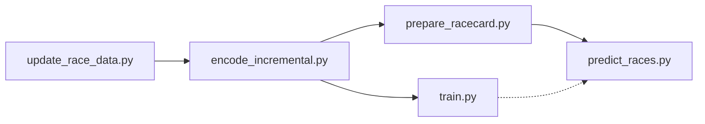

# UK Race Predictor

A machine learning system for predicting UK horse race outcomes using LightGBM. The system processes historical race data, engineers features, trains models, and generates predictions for upcoming races.

## 🐎 What This Project Does

The UK Race Predictor is a complete end-to-end machine learning pipeline that:

- **Collects** historical UK horse racing data using [rpscrape](https://github.com/4A47/rpscrape)
- **Processes** and encodes race data into features for machine learning
- **Engineers** sophisticated features including:
  - Horse historical performance (win rates, course/distance/going preferences)
  - Jockey and trainer statistics (recent form, course specialties)
  - 14-day recent form indicators
  - Time-based features (seasonal patterns)
- **Trains** LightGBM models with probability calibration
- **Predicts** race outcomes with calibrated win probabilities
- **Supports** multiple model versions and betting strategies

## 🚀 Quick Start

### Prerequisites

1. **Python 3.8+** with pip
2. **rpscrape** - Clone and set up [rpscrape](https://github.com/4A47/rpscrape) for data collection

### Installation

1. Clone this repository:
```bash
git clone https://github.com/rickhcchan/UKRacePredictor.git
cd UKRacePredictor
```

2. Install dependencies:
```bash
pip install -r requirements.txt
```

3. Set up configuration (see Configuration section below)

## ⚙️ Configuration

### Setting Up Custom Configuration

1. **Copy the template:**
```bash
cp config/user_settings.conf.template config/user_settings.conf
```

2. **Edit your personal settings:**
```ini
# config/user_settings.conf
[common]
# Path to your rpscrape installation
rpscrape_dir = /path/to/your/rpscrape

# Adjust timeout if needed (seconds)
timeout = 60

# Optional: Change data locations
db_path = data/race_data.db
data_dir = data
models_dir = models
```

### Configuration Files

- **`config/default_settings.conf`** - Default settings (version controlled)
- **`config/user_settings.conf`** - Your personal settings (not in git)
- **`config/user_settings.conf.template`** - Template for personal settings

The system loads `user_settings.conf` first, falling back to `default_settings.conf` for missing values.

## 📊 Pipeline Overview

The system consists of 5 main scripts that form a complete ML pipeline:



**Pipeline Flow:**
- `update_race_data.py` → `encode_incremental.py` → Data preparation
- `encode_incremental.py` → `train.py` → Model training (optional, when retraining)
- `encode_incremental.py` → `prepare_racecard.py` → `predict_races.py` → Daily predictions

All scripts support `--dry-run` for testing and use minimal, essential parameters for clean operation.

## 🔄 Usage Guide

### 1. Initial Setup (First Time Only)

```bash
# Update historical data (may take time for initial download)
python scripts/update_race_data.py

# Encode all historical data into features
python scripts/encode_incremental.py --force-rebuild

# Train the default model
python scripts/train.py
```

### 2. Daily Prediction Workflow

```bash
# Step 1: Update historical data (adds yesterday's results)
python scripts/update_race_data.py

# Step 2: Encode new data into features  
python scripts/encode_incremental.py

# Step 3: Prepare today's racecard (or tomorrow's)
python scripts/prepare_racecard.py                    # Today
python scripts/prepare_racecard.py --date 2025-07-12  # Tomorrow

# Step 4: Generate predictions (uses default model and strategy)
python scripts/predict_races.py                       # Today
python scripts/predict_races.py --date 2025-07-12     # Tomorrow
```

### 3. Use Custom Models

```bash
# Retrain default model with new data
python scripts/train.py

# Train custom model versions
python scripts/train.py --model v1
python scripts/train.py --model experimental

# Use custom models
python scripts/train.py --model my_model
python scripts/predict_races.py --model my_model
```

## 📋 Script Reference

### `update_race_data.py`
Downloads and stores historical race results using rpscrape.

```bash
# Update to current date (default behavior)
python scripts/update_race_data.py

# Test run without changes
python scripts/update_race_data.py --dry-run
```

### `encode_incremental.py`
Processes raw race data into machine learning features.

```bash
# Encode new data since last run
python scripts/encode_incremental.py

# Force complete rebuild (after schema changes)
python scripts/encode_incremental.py --force-rebuild

# Test run without changes
python scripts/encode_incremental.py --dry-run
```

### `train.py`
Trains LightGBM models with probability calibration using JSON configurations.

```bash
# Train default model
python scripts/train.py

# Train specific model configuration
python scripts/train.py --model custom

# Test run without training
python scripts/train.py --dry-run
```

### `prepare_racecard.py`
Downloads and prepares racecard for prediction with feature engineering.

**Note:** Can only download racecards for today or tomorrow (rpscrape limitation).

```bash
# Prepare today's racecard (default)
python scripts/prepare_racecard.py

# Prepare tomorrow's racecard
python scripts/prepare_racecard.py --date 2025-07-12

# Test run without changes
python scripts/prepare_racecard.py --dry-run

# Dry run for specific date
python scripts/prepare_racecard.py --date 2025-07-12 --dry-run
```

### `predict_races.py`
Generates win probability predictions for prepared racecards using JSON model configurations.

```bash
# Predict with default model and default strategy
python scripts/predict_races.py

# Predict with specific model
python scripts/predict_races.py --model custom

# Test run without saving files
python scripts/predict_races.py --dry-run

# Predict with specific strategy
python scripts/predict_races.py --strategy default

# Predict with both custom model and strategy
python scripts/predict_races.py --model custom --strategy default

# Predict specific date
python scripts/predict_races.py --date 2025-07-08

# Combined options
python scripts/predict_races.py --date 2025-07-08 --model custom --strategy default --dry-run
```

### `predict_races_multi.py`
**NEW**: Multi-model race prediction with union logic and model agreement indicators.

```bash
# Predict with multiple models
python scripts/predict_races_multi.py --models win_v2,top3_v2

# Predict for specific date with custom strategy
python scripts/predict_races_multi.py --models default,win_v2 --date 2025-07-16 --strategy default

# Test run without saving
python scripts/predict_races_multi.py --models win_v2,top3_v2 --dry-run

# Custom threshold for display
python scripts/predict_races_multi.py --models win_v2,top3_v2 --threshold 0.25
```

**Multi-Model Features:**
- **Union Logic**: Shows horses predicted by ANY model (not intersection)
- **Model Agreement**: Visual indicators (✓/✗) showing which models selected each horse
- **Probability Display**: Shows calibrated probability from each model regardless of selection
- **Single Strategy**: Uses one strategy across all models for consistent selection logic

**Example Output:**
```
Race 12345 - Ascot - 14:30
Horse Name           win_v2    top3_v2    Recommendation
──────────────────────────────────────────────────────────
Thunder Bay          22% ✓     25% ✓      ⭐ BET (all models)
Lightning Strike     21% ✓     17% ✗      💭 Consider (1/2 models)
Storm Cloud          18% ✗     23% ✓      💭 Consider (1/2 models)
```

## 📁 Project Structure

```
UKRacePredictor/
├── README.md
├── requirements.txt
├── config/
│   ├── default_settings.conf     # Default system settings
│   ├── user_settings.conf.template
│   └── models/
│       └── default.json          # Default model configuration
├── scripts/
│   ├── update_race_data.py       # Data collection
│   ├── encode_incremental.py     # Feature engineering
│   ├── train.py                  # Model training
│   ├── prepare_racecard.py       # Racecard preparation
│   ├── predict_races.py          # Prediction generation
│   ├── betting_strategy.py       # Strategy base class
│   ├── strategy_factory.py       # Strategy factory
│   └── strategies/
│       └── default.py            # Default betting strategy
├── data/                         # Data files (not in git)
├── models/                       # Trained models (not in git)
└── docs/
```

## 🎯 Model Configuration

### Using Different Model Configurations

```bash
# Train different models
python scripts/train.py                           # Uses default.json
python scripts/train.py --model custom            # Uses custom.json  
python scripts/train.py --model experimental      # Uses experimental.json

# Predict with specific models
python scripts/predict_races.py                   # Uses default model
python scripts/predict_races.py --model custom    # Uses custom model
python scripts/predict_races.py --model experimental # Uses experimental model

# Quick start for simple workflow - just edit default.json
python scripts/train.py      # Train with your custom default.json
python scripts/predict_races.py  # Predict with your custom default.json
```

### JSON Configuration Format

Model configurations are stored in `config/models/*.json`:

```json
{
  "model_name": "default",
  "description": "Default model configuration",
  "features": {
    "categorical": ["course_id", "type_id", "sex_id"],
    "ordinal": ["age", "lbs", "dist_f", "ran", "draw"]
  },
  "training_params": {
    "objective": "binary",
    "metric": "binary_logloss",
    "boosting_type": "gbdt",
    "num_leaves": 31,
    "learning_rate": 0.05
  },
  "validation": {
    "test_size": 0.2,
    "calibration_size": 0.2,
    "random_state": 42
  }
}
```

### Creating Custom Model Configurations

1. **Create a new model config file:**
```bash
# Create your model config in config/models/
cp config/models/default.json config/models/my_model.json
```

2. **Edit the configuration:**
```json
{
  "model_name": "my_model",
  "description": "Custom model with specific features",
  "features": {
    "categorical": [
      "course_id", "type_id", "sex_id", "going_id", "jockey_id", "trainer_id"
    ],
    "ordinal": [
      "age", "lbs", "dist_f", "ran", "draw", "or_rating", "ts_rating"
    ],
    "historical": [
      "horse_win_rate_14d", "jockey_win_rate_14d", "trainer_win_rate_14d"
    ]
  },
  "training_params": {
    "objective": "binary",
    "metric": "binary_logloss",
    "boosting_type": "gbdt",
    "num_leaves": 63,
    "learning_rate": 0.03,
    "feature_fraction": 0.8,
    "bagging_fraction": 0.8,
    "bagging_freq": 5,
    "min_child_samples": 20,
    "reg_alpha": 0.1,
    "reg_lambda": 0.1
  },
  "validation": {
    "test_size": 0.2,
    "calibration_size": 0.2,
    "random_state": 42
  }
}
```

3. **Use your custom model:**
```bash
# Train with custom config
python scripts/train.py --model my_model

# Predict with custom model
python scripts/predict_races.py --model my_model
```

### Model Configuration Guidelines

**Feature Categories:**
- **`categorical`** - Text/ID features (course, jockey, trainer, etc.)
- **`ordinal`** - Numeric features with meaningful order (age, weight, rating)
- **`historical`** - Time-based performance features (win rates, form)

**Key Training Parameters:**
- **`num_leaves`** - Model complexity (31-127, higher = more complex)
- **`learning_rate`** - Training speed (0.01-0.1, lower = more stable)
- **`feature_fraction`** - Random feature sampling (0.6-1.0)
- **`min_child_samples`** - Minimum samples per leaf (10-50)

**Performance Tips:**
- Start with `default.json` and modify incrementally
- Test with `--dry-run` before full training
- Monitor validation scores during training
- Use fewer features for faster predictions

### Multiple Model Workflow

```bash
# Train different model versions
python scripts/train.py --model custom     # Uses config/models/custom.json
python scripts/train.py --model experimental # Uses config/models/experimental.json

# Predict with specific version
python scripts/predict_races.py --model custom  # Uses custom config and models
python scripts/predict_races.py --model experimental  # Uses experimental config and models
```

## 🎯 Betting Strategies

The system supports pluggable betting strategies that determine which horses to bet on based on model predictions.

### Available Strategies

- **`default`** - Conservative strategy: min 20% probability, returns highest probability horse only if unique

### Using Strategies

```bash
# Use default strategy
python scripts/predict_races.py --strategy default

# Combine with specific model
python scripts/predict_races.py --model custom --strategy default
```

### Creating Custom Strategies

1. **Create a new strategy file:**
```bash
# Create your strategy in scripts/strategies/
touch scripts/strategies/mystrategy.py
```

2. **Implement the strategy class:**
```python
from typing import List, Dict, Any
import sys
from pathlib import Path

# Add parent directory to path for imports
sys.path.append(str(Path(__file__).parent.parent))
from betting_strategy import BettingStrategy

class MystrategyStrategy(BettingStrategy):  # Class name must be: CapitalCase + "Strategy"
    def __init__(self):
        super().__init__(
            name="mystrategy",  # File name without .py
            description="Custom betting strategy: min 25% probability, max 2 horses per race"
        )
    
    def select_horses(self, horses: List[Dict[str, Any]], race_data: Dict[str, Any]) -> List[Dict[str, Any]]:
        """
        Implement your betting logic here.
        
        Args:
            horses: List of horses with predictions and racecard data
            race_data: Race-level information (course, time, field size, etc.)
            
        Returns:
            List of horses to bet on (can be empty, single, or multiple)
        """
        if not horses:
            return []
        
        # Filter horses above probability threshold
        threshold = 0.25
        candidates = [
            horse for horse in horses 
            if horse.get('calibrated_probability', 0) >= threshold
        ]
        
        if not candidates:
            return []
        
        # Sort by probability (highest first)
        candidates.sort(key=lambda h: h.get('calibrated_probability', 0), reverse=True)
        
        # Return top 2 horses maximum
        return candidates[:2]
```

3. **Advanced strategy example:**
```python
class AdvancedStrategy(BettingStrategy):
    def __init__(self):
        super().__init__(
            name="advanced",
            description="Advanced strategy: probability + race context filters"
        )
    
    def select_horses(self, horses: List[Dict[str, Any]], race_data: Dict[str, Any]) -> List[Dict[str, Any]]:
        if not horses:
            return []
        
        # Get race context
        field_size = len(horses)
        race_type = race_data.get('type', '').lower()
        
        # Adjust strategy based on race type
        if 'handicap' in race_type:
            min_prob = 0.15  # Lower threshold for handicaps
            max_horses = 3
        else:
            min_prob = 0.20  # Higher threshold for non-handicaps  
            max_horses = 2
        
        # Filter by field size
        if field_size > 16:
            min_prob += 0.05  # Higher threshold for large fields
        
        # Select horses
        candidates = [
            horse for horse in horses
            if horse.get('calibrated_probability', 0) >= min_prob
        ]
        
        # Sort by probability and limit
        candidates.sort(key=lambda h: h.get('calibrated_probability', 0), reverse=True)
        return candidates[:max_horses]
```

4. **Use your strategy:**
```bash
python scripts/predict_races.py --strategy mystrategy
python scripts/predict_races.py --strategy advanced
```

### Strategy Naming Convention

**Important**: The strategy factory expects specific naming:
- **File name**: `mystrategy.py` (lowercase, underscores allowed)
- **Class name**: `MystrategyStrategy` (capitalize each word, remove underscores, add "Strategy")
- **Strategy name**: `mystrategy` (same as file name without .py)

**Examples:**
- `mystrategy.py` → `MystrategyStrategy` → `--strategy mystrategy`
- `custom_bet.py` → `CustomBetStrategy` → `--strategy custom_bet`

### Strategy Guidelines

**Available Horse Data:**
- **`calibrated_probability`** - Main prediction (0.0-1.0)
- **`horse_name`** - Horse name
- **`jockey_name`** - Jockey name  
- **`trainer_name`** - Trainer name
- **`age`** - Horse age
- **`lbs`** - Weight carried
- **`or_rating`** - Official rating
- **`ts_rating`** - Timeform rating
- **`draw`** - Starting position

**Available Race Data:**
- **`course`** - Race course name
- **`time`** - Race time
- **`type`** - Race type (handicap, maiden, etc.)
- **`distance`** - Race distance
- **`going`** - Ground conditions

**Best Practices:**
- **Keep it simple** - Complex logic can be hard to debug
- **Use calibrated_probability** - This is the main prediction value
- **Consider race context** - Use race_data for filtering (field size, race type)
- **Return empty list** if no bets recommended
- **Test thoroughly** with different scenarios
- **Start conservative** - Begin with higher probability thresholds
- **Log your logic** - Add print statements for debugging

**Common Strategy Patterns:**
```python
# Probability threshold
candidates = [h for h in horses if h.get('calibrated_probability', 0) >= 0.20]

# Top N horses
horses_sorted = sorted(horses, key=lambda h: h.get('calibrated_probability', 0), reverse=True)
return horses_sorted[:2]

# Conditional logic
if len(horses) > 12:  # Large field
    threshold = 0.25
else:  # Small field  
    threshold = 0.15

# Race type filtering
if 'handicap' in race_data.get('type', '').lower():
    # Different logic for handicaps
    pass
```

## 🎯 Race Contextual Features

The system includes advanced race contextual features that provide **apples-to-apples field comparisons** for superior prediction accuracy. These features replace absolute ratings with race-specific relative positioning.

### Overview

Traditional horse racing models use absolute values (e.g., "horse has 85 OR rating") which ignore the competitive context of each specific race. Our race contextual features instead ask: **"How does this horse compare to the other horses in THIS race?"**

### New Race Contextual Features

#### 1. `horse_rating_vs_field_avg`
- **Description**: Horse's last OR rating minus the average of all other horses' last OR ratings in the race
- **Logic**: Apples-to-apples comparison of most recent form
- **Example**: Horse rated 90 in field where others average 82 = +8.0 advantage
- **Benefit**: Shows relative strength vs. immediate competition

#### 2. `horse_avg_vs_field_avg`  
- **Description**: Horse's 90-day average rating minus field average of 90-day averages
- **Logic**: Consistent form comparison over recent months
- **Example**: Horse's 90d avg 85 vs field 90d avg 78 = +7.0 advantage
- **Benefit**: Identifies horses with sustained good form relative to competition

#### 3. `horse_rating_percentile`
- **Description**: Horse's percentile ranking within the race field (0-100%)
- **Logic**: Shows where horse stands in competitive hierarchy
- **Example**: Horse ranks 80th percentile = beats 80% of field on ratings
- **Benefit**: Intuitive measure of competitive position

#### 4. `stronger_horses_count`
- **Description**: Count of horses with higher last OR ratings in the race
- **Logic**: Direct measure of how many horses are "better" rated
- **Example**: 2 stronger horses = horse faces 2 higher-rated competitors
- **Benefit**: Quantifies competitive challenge level

### Feature Importance Results

Analysis of the **top3_v2** model shows exceptional performance of race contextual features:

- **`stronger_horses_count`**: **4th most important feature** (17,412 importance)
- **`horse_rating_percentile`**: **7th most important feature** (11,893 importance)
- **`horse_avg_vs_field_avg`**: **18th most important feature** (1,134 importance)
- **`horse_rating_vs_field_avg`**: **25th most important feature** (441 importance)

### Methodology: Apples-to-Apples Comparisons

**Traditional Approach (Problematic):**
```
Horse A: Last rating 90, 90d average 85
Horse B: Last rating 75, 90d average 80
```
❌ **Mixed comparison**: Comparing A's last vs B's average

**New Approach (Correct):**
```
Field last ratings: [90, 85, 82, 75, 70]     → Field avg: 80.4
Field 90d averages: [85, 82, 78, 73, 71]     → Field avg: 77.8

Horse A: Last 90 vs field last avg 80.4 = +9.6
Horse A: 90d avg 85 vs field 90d avg 77.8 = +7.2
```
✅ **Consistent comparison**: Last vs last, average vs average

### Benefits Over Absolute Ratings

#### 1. **Race-Specific Context**
- Absolute rating of 85 means different things in different races
- In weak field: 85 might be dominant (+15 above average)
- In strong field: 85 might be struggling (-10 below average)

#### 2. **Competitive Positioning**  
- Focuses on "can this horse beat THESE horses" vs "is this horse good"
- More relevant for betting decisions
- Accounts for race difficulty automatically

#### 3. **Consistent Methodology**
- All field calculations use same rating type (last-to-last, avg-to-avg)
- Eliminates methodological inconsistencies
- Provides cleaner signal to machine learning model

### Model Integration

**V2 Models (win_v2.json, top3_v2.json):**
- ✅ Include all 4 race contextual features  
- ❌ Removed redundant absolute rating features:
  - `horse_last_or_rating` → Replaced by `horse_rating_vs_field_avg`
  - `horse_avg_or_90d` → Replaced by `horse_avg_vs_field_avg`
  - `horse_or_sample_size` → Less predictive than field context
  - `horse_or_trend_direction` → Less useful than relative positioning

**Original Models (win.json, top3.json):**
- Unchanged for backwards compatibility
- Still use absolute rating features
- Available for comparison testing

### Implementation Details

Race contextual features are calculated during encoding in `encode_incremental.py`:

1. **Field Collection**: For each race, collect historical ratings for all horses
2. **Separate Calculations**: Calculate field averages separately for last ratings and 90d averages  
3. **Individual Comparison**: Compare each horse's ratings against appropriate field average
4. **Percentile Ranking**: Rank horse within field and convert to percentile

### Performance Impact

The race contextual approach delivers significantly improved prediction accuracy:

- **Better field understanding**: Model learns competitive dynamics
- **Reduced noise**: Eliminates absolute rating variations across different eras
- **Enhanced signal**: Focuses on race-specific competitive advantages
- **Improved calibration**: Probabilities better reflect actual win rates in different competitive contexts

This represents a major advancement in horse racing prediction methodology, moving from absolute assessment to competitive context analysis.

## 🤖 Multi-Model Predictions

The system supports advanced multi-model predictions that combine insights from multiple trained models for enhanced decision-making confidence.

### Overview

Multi-model prediction provides **model agreement analysis** and **union recommendations** by running multiple models simultaneously and showing where they agree or disagree on horse selections.

### Key Benefits

1. **Confidence Validation**: See when multiple models agree on a selection
2. **Risk Assessment**: Identify horses selected by only some models
3. **Probability Comparison**: Compare calibrated probabilities across different model approaches
4. **Consensus Betting**: Make decisions based on model agreement levels

### Usage

```bash
# Basic multi-model prediction
python scripts/predict_races_multi.py --models win_v2,top3_v2

# Custom strategy and threshold
python scripts/predict_races_multi.py --models default,win_v2,top3_v2 --strategy default --threshold 0.25
```

### Output Format

The multi-model output shows:
- **Horse Name**: Horse identifier
- **Model Columns**: Calibrated probability + selection indicator (✓/✗) for each model
- **Recommendation**: Overall recommendation based on model agreement

### Recommendation Categories

- **⭐ BET (all models)**: All models selected this horse - highest confidence
- **💭 Consider (X/Y models)**: Some models selected - moderate confidence  
- **📊 Watch (above threshold)**: Above probability threshold but not selected
- *(No indicator)*: Below threshold and not selected by any model

### Strategy Application

- **Single Strategy**: One betting strategy is applied consistently across all models
- **Union Logic**: Shows horses selected by ANY model (not requiring all models to agree)
- **Threshold Display**: Only shows horses above probability threshold OR selected by at least one model

### Best Practices

1. **Model Diversity**: Use models with different feature sets for better insights
2. **Agreement Focus**: Prioritize horses selected by multiple models
3. **Strategy Consistency**: Use the same strategy across models for fair comparison
4. **Threshold Tuning**: Adjust threshold based on your risk tolerance

### Example Scenarios

**High Confidence (All Models Agree):**
```
Thunder Bay    22% ✓    25% ✓    ⭐ BET (all models)
```

**Mixed Signals (Partial Agreement):**
```
Storm Cloud    18% ✗    23% ✓    💭 Consider (1/2 models)
```

**Watch List (Above Threshold):**
```
Rain Dance     21% ✗    19% ✗    📊 Watch (above threshold)
```

## 🎧 Testing Strategies

The `test_strategy_system.py` script is provided to validate your strategies and ensure they work as expected within the system.

### Usage

```bash
# Test all strategies
python scripts/test_strategy_system.py

# Test specific strategy
python scripts/test_strategy_system.py --strategy mystrategy
```

### Script Logic

1. **Load test racecard**: Uses a sample racecard with known outcomes
2. **Run all strategies**: Executes each strategy in `scripts/strategies/`
3. **Capture outputs**: Collects and displays selected horses and recommended actions
4. **Compare with expected**: Checks strategy outputs against expected selections

### Example Output

```
Testing strategy: Mystrategy
Race 12345 - Ascot - 14:30
Horse Name           Calibrated Probability    Selected
──────────────────────────────────────────────────────────
Thunder Bay          0.22                      Yes
Lightning Strike     0.18                      No
Storm Cloud          0.15                      Yes
```

### Best Practices

- **Test after changes**: Always test strategies after making changes to logic or parameters
- **Review outputs**: Check selected horses and recommendations for correctness
- **Compare with expectations**: Ensure strategy behavior matches your intended logic

## 🔧 Development

### Adding New Features

1. **Historical features** - Modify `encode_incremental.py`
2. **Model parameters** - Edit JSON configs in `config/models/`
3. **Betting logic** - Create new strategy in `scripts/strategies/`

### Testing

```bash
# Test all scripts with dry-run
python scripts/update_race_data.py --dry-run
python scripts/encode_incremental.py --dry-run
python scripts/train.py --dry-run
python scripts/prepare_racecard.py --dry-run
python scripts/predict_races.py --dry-run

# Test strategy system
python scripts/test_strategy_system.py
```

## 📝 Important Notes

### Data Leakage Prevention
- All historical features use `race_date < target_date` filtering
- No same-day data is used for feature calculation
- 14-day windows strictly exclude the prediction date

### File Management
- **CSV outputs are optional** - Use `--dry-run` for testing without file changes
- **Models are not in git** - Train locally for your data
- **Strategies are private** - Only `default.py` is version controlled

### Performance Tips
- **Incremental encoding** is much faster than full rebuilds
- **Feature lists** in model configs control prediction speed
- **Probability calibration** significantly improves accuracy

## 🤝 Contributing

1. Fork the repository
2. Create your feature branch
3. Test with `--dry-run` options
4. Ensure all scripts work independently
5. Submit a pull request

## 📄 License

This project is licensed under the MIT License - see the LICENSE file for details.

## 🙏 Acknowledgments

- [rpscrape](https://github.com/4A47/rpscrape) for data collection capabilities
- Racing Post for providing the underlying data source
- LightGBM team for the excellent gradient boosting framework
